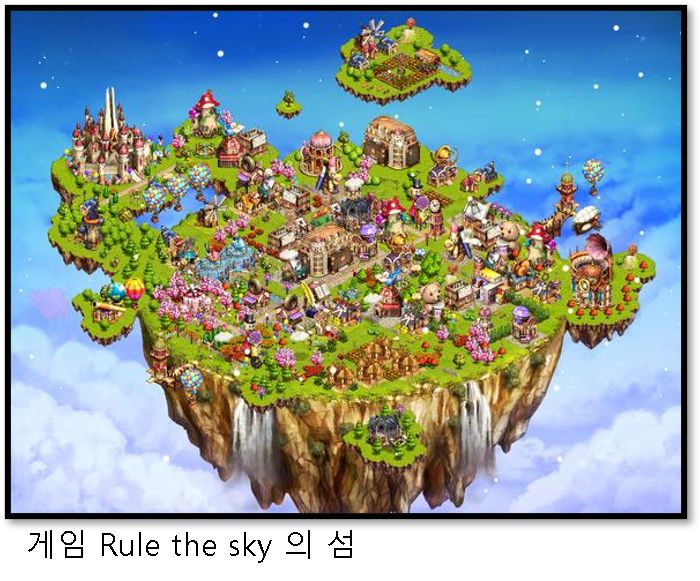
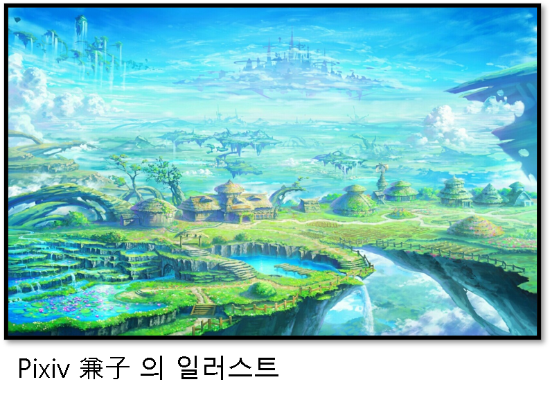
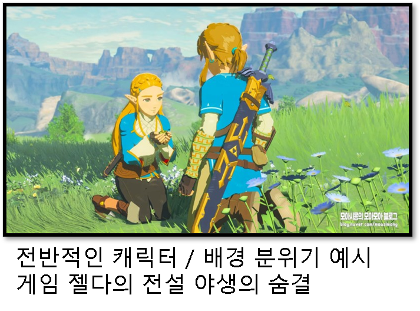
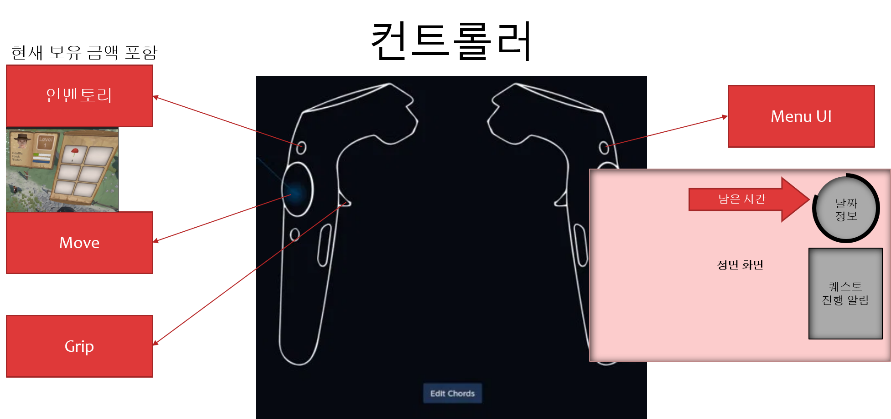
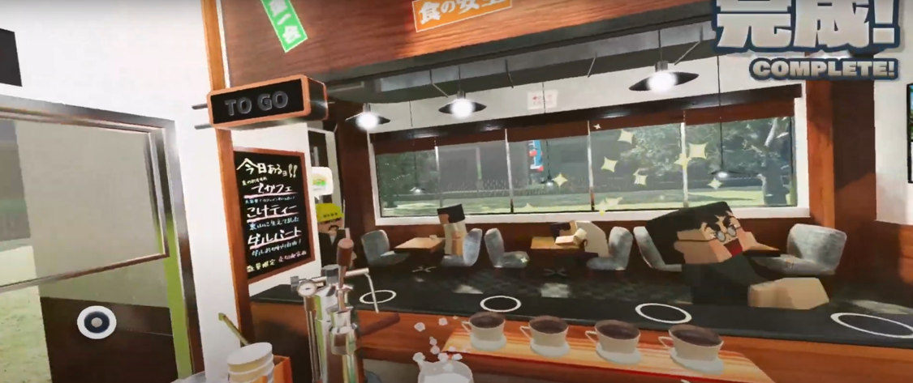
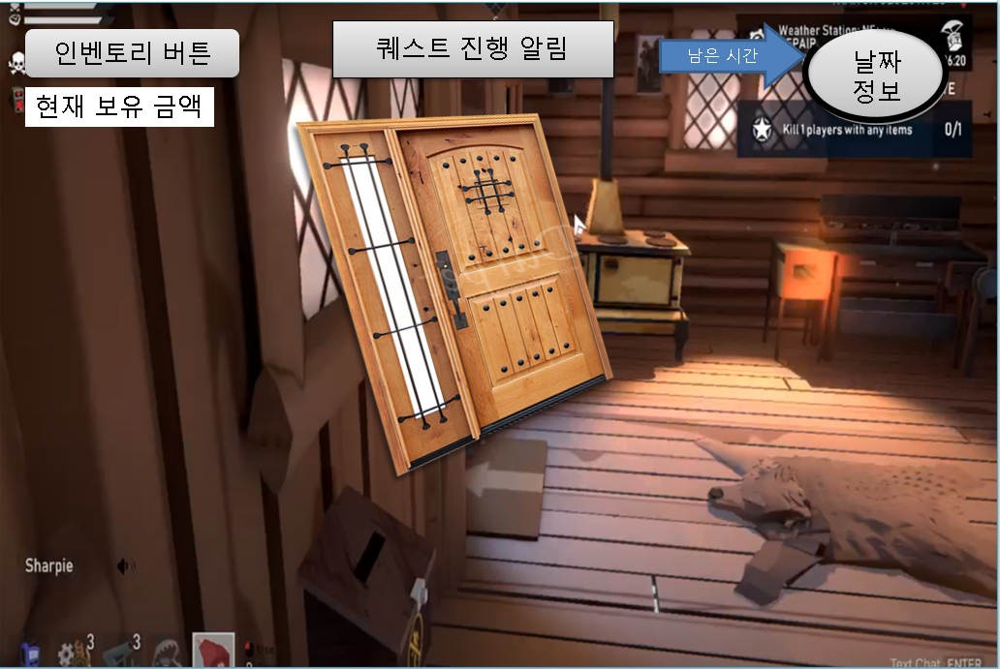

# [컨셉]

## 어드벤처(Advanture)
 > 말 그대로 모험심을 자극하는 세계관인 포스트 아포칼립스를 활용하여 새로운 세계를 체험하는 것을 목표로 함.  
 장르는 어드벤처로, VR로 구현할 예정

 

### 현실성 
 > 랜덤으로 생성되는 퀘스트와 특정 주기로 방문하는 주민들을 활용하여 마치 내가 실제로 살아가는 느낌을 줌
  

### 로그라이크
 > 직접 방문할 수 있는 맵들과 퀘스트와 상호작용을 할 수 있는 것을 이용하여 로그라이크의 분위기를 띔
  

### 그래픽 
 > 외주 및 에셋을 활용한 그래픽으로 좀 더 생동감 있게 표현을 할 수 있게 함
  
  
### 생활감
 > 하우징 시스템을 통해 내가 이 세계의 주민이 된 것 처럼 느낄 수 있게 함

  
# [관련 이미지 & 동영상]

## 1. 이미지
> 
> 
> 
> 

## 2. 동영상
>  [VR 컨트롤러 관련 참고 영상]w
>
>
>
>
>
>   
> [VR 내부시스템 및 서브컨텐츠 참고 영상]
>
>

  
# [대표 이미지]

  
# [컨셉 & 대표이미지 기반 작품묘사]

> * ### 대표이미지 기반 : 1인칭 VR로 비춰지며 퀘스트를 들고오는 NPC를 확인할 수 있습니다. 주변에는 플레이어가 구성한 인테리어가 보입니다.
>
> * ### 컨셉 기반 : 랜덤성 있는 주기적인 퀘스트와 자유로운 맵을 바탕으로 가벼운 디자인과 하우징 시스템 등을 겸한 최종적으로 모험을 느끼게 해주는 어드벤처 게임입니다.

  
# [구성 요소]

## 1. 메커니즘

> * ### [도전 과제]
>   1. 새로운 환경에서 수집하며 생활하라!
>   2. 나만의 집을 꾸며라!
>   3. 세상의 비밀을 알아가라!
> * ### [재미 요소]
>   1. 채집과 채광, 사냥 등을 하면서 생활감을 줍니다.
>   2. 의뢰를 진행하면서 얻은 요소(하우징 등)를 이용해 자유도를 높입니다.
>   3. 특수 퀘스트를 진행하여 신비한 모험을 진행할 수 있습니다.
 

 

## 2. 이야기

> * ### [줄거리]
>   어느 마을에 살고 있는 남/여자. 잠에서 깨어난 이들은 작은 의뢰소를 운영해야만 한다는 것을 느끼게 된다.  
    의뢰소를 운영하던 어느날 수수께끼의 남성이 남긴 메시지를 확인하고 모험을 떠난다.  
    그리하여 본인이 살고 있는 지역에 대한 비밀을 알게되는데...
>
> * ### [만들게 된 배경] 
>   새로운 세계에 대한 동경심 등을 자극시키는 VR로 이루어진 어드벤처 게임을 만들어 보는 것이 좋다 생각하여 만들게 되었습니다.
>
> * ### [카메라 관점]
>   직접 생활하는 듯한 느낌을 들게 하기 위하여 1인칭 시점을 사용한 카메라를 이용할 예정입니다. VR 시스템의 내부적으로 지원하는 카메라로 구성할 예정입니다.

## 3. 미적요소

> 1. 카툰랜더링을 사용한 그래픽으로 게임의 부담감을 적게 할 예정입니다.
>
> 2. 대부분 청정한 컬러를 사용하여 자연적 느낌을 연출 할 예정입니다.
>
> 3. 최대한 일상적이고 자연적인 음향을 사용하되, 각 지형에 따라 특색있는 음향을 사용할 예정입니다.

 

## 4. 기술
